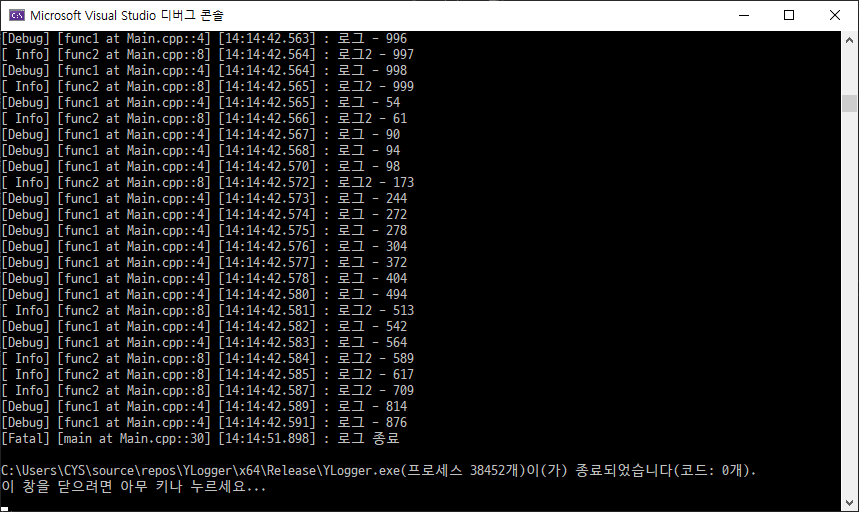

# YLogger
YLogger is cross platform logging project based c++17.

This is very simple and single header logging.  
Also `YLogger` is thread-safe, fast, light.

`YLogger` support ConsoleAppender, FileAppender, RollingAppender.

It can use very easy. Basic settings can be made simply by creating a conig file.

## Example code

```cpp
#include "YLogger.h" // only include single header file

int main() {
    system("chcp 949");
    logger::YLogger::Initialize(); // default config
    //logger::YLogger::Initialize(".\YLogger.config"); // put config path
    LOG_DEBUG("로그 1 입니다.");
    std::this_thread::sleep_for(std::chrono::milliseconds(1000));
    for (int i = 0; i < 1000; i++) {
        std::thread tt([i]() {
            // thread-safe log
            if (i % 2 == 0) {
                LOG_DEBUG("로그" + std::to_string(i));
            }
            else {
                LOG_INFO("로그" + std::to_string(i));
            }
            });
        tt.detach();
    }
    std::this_thread::sleep_for(std::chrono::milliseconds(10000));
    LOG_FATAL("로그 종료");
}

```

You can use `YLogger` just by initialize it.

## Sample image


