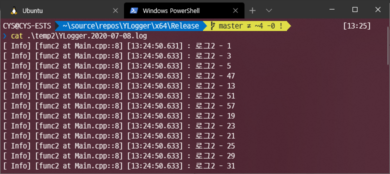
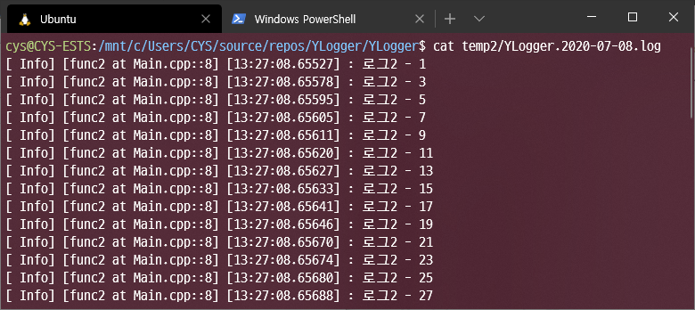

# YLogger
YLogger is cross platform logging project based c++17.

This is very simple and single header logging.  
Also `YLogger` is thread-safe, fast, light.

`YLogger` support ConsoleAppender, FileAppender, RollingAppender.

It can use very easy. Basic settings can be made simply by creating a conig file.

## Example code

```cpp
#include "YLogger.h" // only include single header file

void func1(int i) {
    LOG_DEBUG("로그 - " + std::to_string(i));
}

void func2(int i) {
    LOG_INFO("로그2 - " + std::to_string(i));
}

int main() {
    system("chcp 949");

    // Default config, Not essential. default is logger::LogLevel::Debug
    //logger::YLogger::Initialize(); 

    // Set logger level logger::LogLevel::Info. So, The logger does not show logs below the info level.
    logger::YLogger::Initialize(logger::LogLevel::Info); 

    // Set logger to console
    logger::YLogger::GetLogger()->AddLogger(logger::LoggerType::ConsoleAppender);

    // Default save ./Log
    logger::YLogger::GetLogger()->AddLogger(logger::LoggerType::FileAppender);

    // Set save log file path
    logger::YLogger::GetLogger()->AddLogger(logger::LoggerType::FileAppender, "./temp2");

    std::cout << "FileAppender write 100 lines" << std::endl;

    for (int i = 0; i < 100; i++) {
        std::thread tt([i]() {
            // thread-safe log
            if (i % 2 == 0) {
                func1(i);
            }
            else {
                func2(i);
            }
            });
        tt.detach();
    }

    return 0;
}
```

You can use `YLogger` just by initialize it.

## Sample image

There are some sample images.
g++ build with `g++ Main.cpp YLogger.h -std=c++17 -pthread -o ylogger_example.out` command.

### Windows ConsoleAppender


### Ubnutu ConsoleAppender


### Windows FileAppender



### Ubnutu FileAppender



---

## Performance

### SingleThread

The test is based on an average value of five measurements of the time taken when 100,000 logs were recorded in a single thread.

```text
FileAppender write 100,000 lines
350ms

ConsoleAppender write 100,000 lines
14767ms
```

### MultiThread

The test is based on an average value of five measurements of the time taken when 1 log in each 100,000 threads were recorded in a multi thread include create thread time.

```text
FileAppender write 100,000 lines
5575ms

ConsoleAppender write 100,000 lines
25310ms
```

## TODO

- [ ] Support dynamic config file change(using FileWatcher, `FileWatcher` is already implemented)
- [ ] Support File Appender
- [ ] Support Thread pool for multi appender
- [ ] Support Rolling Appender(zip files, clean up...)
